### 2. 已知a={{"nickname" : "one", "age" = "20"}, {"nickname" : "two", "age" = "22"}, {"nickname" : "three", "age" = "21"}, {"nickname" : "four", "age" = "30"}},如何利用age字段对a进行降序排序  

``` python
a = [{ "nickname" : "one", "age" : 20},  
{ "nickname" : "two", "age" : 22 },
{ "nickname" : "three", "age" : 21 },
{ "nickname" : "four" , "age" : 30 }]
  
  
# 按 age 降序排序
print ("列表通过 age 降序排序: ")
print (sorted(a, key = lambda i: i['age'],reverse=True) )
```

实现思路：

* 利用sorted()函数，指定reverse = True进行降序排序
* key指定age为排序参数，lambda简化函数，指定i为函数接口，i['age']为函数体，既通过age中的参数对a进行降序排序

运行结果：  

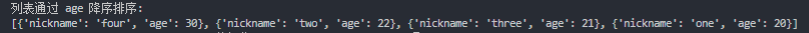

### 3. 已知如下表结构，编写一个sql查询，满足条件：无论是否存在nickname的address信息，都要基于两表提供nickname的以下信息 username,sex,city,state  

``` sql
drop table user_info;
create table user_info
(
    nickname varchar(100),
    username varchar(100),
    sex varchar(100)
)charset = utf8;

alter table user_info add PRIMARY key(nickname);

drop table address;
create table address
(
    address_id int,
    nickname varchar(100),
    city varchar(100),
    state varchar(100)
)charset = utf8;

alter table address add primary key(address_id);

insert into user_info values ("tom","a","F");
insert into user_info values ("lana","b","F");
insert into user_info values ("zoo","c","M");

insert into address values (1,"lana","杭州","浙江");
insert into address values (2,"tom","桂林","广西");

select a.nickname,a.username,a.sex,b.city,b.state
from
(
    user_info a
    left JOIN
    address b
    on a.nickname = b.nickname
);
```

实现思路：

* 先建表插入信息，选择合适的数据存储格式，控制主键
* 运用left join的方法在不删除左表（user_info）中在右表（address）中找不到对应数据的前提下，选择出对应的username,sex,city和state信息  

运行结果：

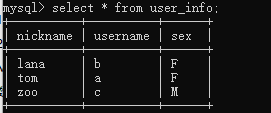

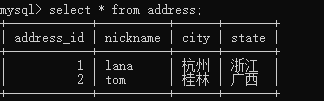

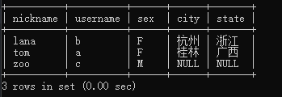

---

### 4. 编写一个sql语句，要求删除表中所有重复的app_name,对于重复的行只保留id最大的行

```sql
create table app_info
(
    id int,
    app_name varchar(100)
) charset = utf8;

ALTER table app_info add PRIMARY key(id);

insert into app_info values (1,"第五人格");
insert into app_info values (2,"第五人格");
insert into app_info values (3,"荒野行动");
insert into app_info values (4,"倩女幽魂");
insert into app_info values (5,"绝地求生");
insert into app_info values (6,"海岛纪元");
insert into app_info values (7,"海岛纪元");

create table temp_app_info
(
    id int(11) not null
);
insert into temp_app_info
select a.id
from
(
    select max(id) as id
    from app_info group by app_name
) a;

delete
from app_info
where id not in
(
    select id
    from temp_app_info
);
```

实现思路：

* 创建一张临时表（只有一个id字段）用于保存需要保留的id，然后通过group by和max函数找出需要保留的id并插入到临时表中，最后使用not in子句将id不在临时表中的那些数据删除

运行结果：

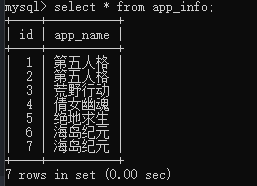

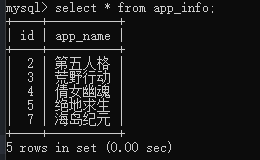

---

### 5. 已知下表结构，编写一个sql语句，要求查询出每个部门中玩过的游戏数量最多的员工

``` sql
drop table user_info;
create table user_info
(
    nickname varchar(100),
    username varchar(100),
    dept_id int,
    game_count int
) charset = utf8;

insert into user_info values ("zhangsan","张三",1,108);
insert into user_info values ("lisi","李四",1,120);
insert into user_info values ("wangwu","王五",2,170);
insert into user_info values ("zhaosi","赵四",2,10);
insert into user_info values ("tom","汤姆",3,190);

drop table dept_info;
create table dept_info
(
    dept_id int,
    dept_name varchar(100)
) charset = utf8;

insert into dept_info values (1,"财务");
insert into dept_info values (2,"IT");
insert into dept_info values (3,"开发");

create table temp_5
(
    dept_name varchar(100),
    user_name varchar(100),
    game_count int
) charset = utf8;

insert into temp_5
select b.dept_name,a.username,a.game_count
from
(
    (
        select *
        from user_info
        order by game_count desc
    ) a
    left join
    dept_info b
    on a.dept_id = b.dept_id
);

create table temp_5_1
(
    dept_name varchar(100),
    user_name varchar(100),
    game_count int
) charset = utf8;

insert into temp_5_1
select *
from temp_5
order by game_count desc;

create table temp_5_2
(
    dept_name varchar(100),
    user_name varchar(100),
    game_count int
) charset = utf8;

insert into temp_5_2
select *
from temp_5_1
group by dept_name;
```

实现思路：

* 遇到了group by和order by同时出现的默认顺序问题，采用了比较繁琐但可以得到正确输出结果的新建表，分步操作提取数据方法
* mysql默认先运行group by，即无法同时完成先排序再取最大值

运行结果：

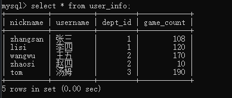

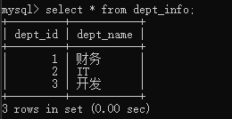

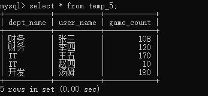

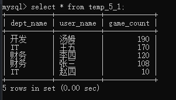

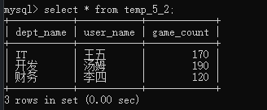
