---

### 1. 用python设计一个装饰器，实现计算函数的运行时间  

```python  
def calculate_function_run_time(func):

    def call_fun(*args, **kwargs):
        start_time = time.time()
        #time.time()返回当前时间的时间戳（1970纪元后经过的浮点秒数）
        f = func(*args, **kwargs)
        #程序运行
        end_time = time.time()
        print('%s() run time：%s ms' % (func.__name__, int(1000*(end_time - start_time))))
        #以毫秒为单位显示
        return f
    return call_fun

@calculate_function_run_time
# == test1 = calculate_function_run_time(test1)
def test1():
    for i in range(100000):
        i = i +1

@calculate_function_run_time
def test2():
    for i in range(10000000):
        i = i +1

if __name__ == "__main__":
# 防止被import时运行
    test1()
    test2()
```  

实现思路：  

* 使用函数装饰器修改/补足函数的功能，使代码简洁化  
* 使用time库中的time()函数获取当前时间，相减计算函数运行时间

``` python
@calculate_function_run_time
# == test1 = calculate_function_run_time(test1)
def test1():
    for i in range(100000):
        i = i +1
```

* 既把test1()作为函数的参数传入另一个函数（时间计算函数）中进行处理，即不会影响test1()本身的定义，时间计算函数也可以多次对多个不同的函数使用。

运行结果


---
  
### 2. 已知a={{"nickname" : "one", "age" = "20"}, {"nickname" : "two", "age" = "22"}, {"nickname" : "three", "age" = "21"}, {"nickname" : "four", "age" = "30"}},如何利用age字段对a进行降序排序  

``` python
a = [{ "nickname" : "one", "age" : 20},  
{ "nickname" : "two", "age" : 22 },
{ "nickname" : "three", "age" : 21 },
{ "nickname" : "four" , "age" : 30 }]
  
  
# 按 age 降序排序
print ("列表通过 age 降序排序: ")
print (sorted(a, key = lambda i: i['age'],reverse=True) )
```

实现思路：

* 利用sorted()函数，指定reverse = True进行降序排序
* key指定age为排序参数，lambda简化函数，指定i为函数接口，i['age']为函数体，既通过age中的参数对a进行降序排序

运行结果：  

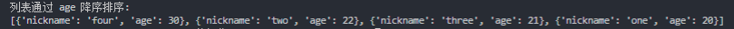

### 3. 已知如下表结构，编写一个sql查询，满足条件：无论是否存在nickname的address信息，都要基于两表提供nickname的以下信息 username,sex,city,state  

``` sql
drop table user_info;
create table user_info
(
    nickname varchar(100),
    username varchar(100),
    sex varchar(100)
)charset = utf8;

alter table user_info add PRIMARY key(nickname);

drop table address;
create table address
(
    address_id int,
    nickname varchar(100),
    city varchar(100),
    state varchar(100)
)charset = utf8;

alter table address add primary key(address_id);

insert into user_info values ("tom","a","F");
insert into user_info values ("lana","b","F");
insert into user_info values ("zoo","c","M");

insert into address values (1,"lana","杭州","浙江");
insert into address values (2,"tom","桂林","广西");

select a.nickname,a.username,a.sex,b.city,b.state
from
(
    user_info a
    left JOIN
    address b
    on a.nickname = b.nickname
);
```

实现思路：

* 先建表插入信息，选择合适的数据存储格式，控制主键
* 运用left join的方法在不删除左表（user_info）中在右表（address）中找不到对应数据的前提下，选择出对应的username,sex,city和state信息  

运行结果：

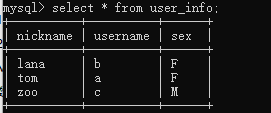

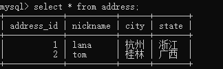

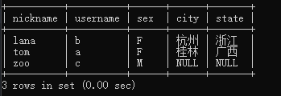

---

### 4. 编写一个sql语句，要求删除表中所有重复的app_name,对于重复的行只保留id最大的行

```sql
create table app_info
(
    id int,
    app_name varchar(100)
) charset = utf8;

ALTER table app_info add PRIMARY key(id);

insert into app_info values (1,"第五人格");
insert into app_info values (2,"第五人格");
insert into app_info values (3,"荒野行动");
insert into app_info values (4,"倩女幽魂");
insert into app_info values (5,"绝地求生");
insert into app_info values (6,"海岛纪元");
insert into app_info values (7,"海岛纪元");

create table temp_app_info
(
    id int(11) not null
);
insert into temp_app_info
select a.id
from
(
    select max(id) as id
    from app_info group by app_name
) a;

delete
from app_info
where id not in
(
    select id
    from temp_app_info
);
```

实现思路：

* 创建一张临时表（只有一个id字段）用于保存需要保留的id，然后通过group by和max函数找出需要保留的id并插入到临时表中，最后使用not in子句将id不在临时表中的那些数据删除

运行结果：

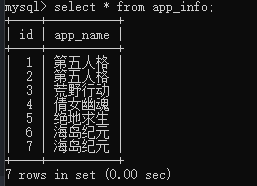

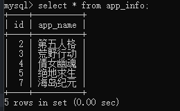

---

### 5. 已知下表结构，编写一个sql语句，要求查询出每个部门中玩过的游戏数量最多的员工

``` sql
drop table user_info;
create table user_info
(
    nickname varchar(100),
    username varchar(100),
    dept_id int,
    game_count int
) charset = utf8;

insert into user_info values ("zhangsan","张三",1,108);
insert into user_info values ("lisi","李四",1,120);
insert into user_info values ("wangwu","王五",2,170);
insert into user_info values ("zhaosi","赵四",2,10);
insert into user_info values ("tom","汤姆",3,190);

drop table dept_info;
create table dept_info
(
    dept_id int,
    dept_name varchar(100)
) charset = utf8;

insert into dept_info values (1,"财务");
insert into dept_info values (2,"IT");
insert into dept_info values (3,"开发");

create table temp_5
(
    dept_name varchar(100),
    user_name varchar(100),
    game_count int
) charset = utf8;

insert into temp_5
select b.dept_name,a.username,a.game_count
from
(
    (
        select *
        from user_info
        order by game_count desc
    ) a
    left join
    dept_info b
    on a.dept_id = b.dept_id
);

create table temp_5_1
(
    dept_name varchar(100),
    user_name varchar(100),
    game_count int
) charset = utf8;

insert into temp_5_1
select *
from temp_5
order by game_count desc;

create table temp_5_2
(
    dept_name varchar(100),
    user_name varchar(100),
    game_count int
) charset = utf8;

insert into temp_5_2
select *
from temp_5_1
group by dept_name;
```

实现思路：

* 遇到了group by和order by同时出现的默认顺序问题，采用了比较繁琐但可以得到正确输出结果的新建表，分步操作提取数据方法
* mysql默认先运行group by，即无法同时完成先排序再取最大值

运行结果：

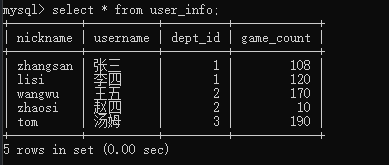

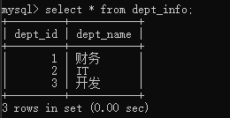

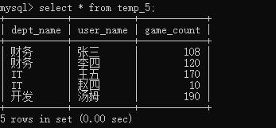

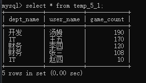

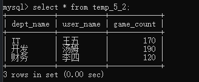

---

### 6. 爬虫 应用id|应用名称|应用图标|发布日期|价格|游戏平台|游戏排名|抓取日期

实现思路：

* 6_1.py为可以直接运行的版本
* 6_2.py为定时运行的版本
* 需要手动更改mysql的登录账户和密码
* html文件中没有找到应用id的标签，暂时以游戏排名为id（即以排序为应用id）
* 采用requests获取网页url,用bs4进行页面解析

```python
r = requests.get("https://store.steampowered.com/search/?os=win&filter=popularnew")
soup = BeautifulSoup(r.text,"html.parser")
```

* 以游戏名称game_name为例：

```python
game_names = soup.find_all('span',attrs={'class':'title'})
```

* 以pymysql和mysql为数据库的方式
* 数据库结构如下

```python
print('连接到mysql服务器...')
db = pymysql.connect(host="localhost", port=3306, user="root", passwd="root", charset='utf8',database = 'steam')
print('连接上了!')
cursor = db.cursor()

cursor.execute("DROP TABLE IF EXISTS STEAM")

# 检查mysql语句是否运行
# cursor.execute("drop table if exists yoyo")

sql = """CREATE TABLE STEAM (
    ID varchar(100),
    game_name varCHAR(100),
    picture varchar(200),
    released_time varchar(100),
    price varchar(100),
    platform varchar(100),
    find_time varchar(100)
    )character set = utf8"""

cursor.execute(sql)

cursor.execute('insert into steam (id,game_name,released_time,price,find_time,picture,platform) values (%s,%s,%s,%s,%s,%s,%s)',
(count,str(name_now),str(released_time_now),str(price_now),str(time_now),str(pic.img.get('src')),str(plat_now)))
```

* 以zip_longest和list结合的方式对每条信息执行插入

```python
for (game_name,released_time,game_price_1,pic,el) in list(zip_longest(game_names,released_times,game_price_1s,pics,els)):
```

* 主体执行

```python
for (game_name,released_time,game_price_1,pic,el) in list(zip_longest(game_names,released_times,game_price_1s,pics,els)):
    # time.sleep(60)
    cursor = db.cursor()
    # cursor.execute('insert into steam (name) values (11);')
    print(pic.img.get('src'))

    # pic_save = requests.get(pic.img.get('src'))
    # with open(path+'.jpeg','wb') as f:
    #     f.write(r.content)
    # src=img[2].get('src')

    # # # r = requests.get(IMAGE_URL)
    # # # with open('./image/img2.png', 'wb') as f:
    # # #     f.write(r.content)

    print(game_name.string)
    # sql = 'insert into steam (game_name) values %s;'
    name_now = game_name.text.strip()
    # add = cursor.execute(sql,name_now)
    released_time_now = released_time.text.strip()

    if "Free" in game_price_1.text:
            print(game_price_1.text.strip())
            price_now = game_price_1.text.strip()
    elif "-" in game_price_1:
         continue
    else:
        price = game_price_1.text.split('¥',1)
            # print(price[1].strip())
        if "¥" in price[1]:
            price_1 = price[1].split('¥',1)
                # print('原价')
                # print(price_1[0].strip()) #原价
                # print('现价')
            print(price_1[1].strip()) #现价
            price_now = price_1[1].strip()
        else:
                # print('原价')
            print(price[1].strip()) #原价
            price_now = price[1].strip()


    platform_win = el.find('span',attrs={'class':'platform_img win'})
    platform_mac = el.find('span',attrs={'class':'platform_img mac'})
    platform_linux = el.find('span',attrs={'class':'platform_img linux'})
    print(platform_win,platform_mac,platform_linux)
    if ((platform_win != [] or platform_win is not None) and (platform_mac == [] or platform_mac is None) and (platform_linux == [] or platform_linux is None)):
        plat_now = 'win'
    elif ((platform_win != [] or platform_win is not None) and (platform_mac != [] or platform_mac is not None) and (platform_linux == [] or platform_linux is None)):
        plat_now = 'win,mac'
    elif ((platform_win != [] or platform_win is not None) and (platform_mac == [] or platform_mac is None) and (platform_linux != [] or platform_linux is not None)):
        plat_now = 'win,linux'
    elif ((platform_win != [] or platform_win is not None) and (platform_mac != [] or platform_mac is not None) and (platform_linux != [] or platform_linux is not None)):
        plat_now = 'win,linux,mac'
    else:
        plat_now = '？？？'


    time_now = datetime.datetime.now().strftime('%Y-%m-%d %H:%M:%S')#现在
    cursor.execute('insert into steam (id,game_name,released_time,price,find_time,picture,platform) values (%s,%s,%s,%s,%s,%s,%s)',
    (count,str(name_now),str(released_time_now),str(price_now),str(time_now),str(pic.img.get('src')),str(plat_now)))
    print(released_time.string)
    db.commit()
    print('******完成此条插入!')
    count+=1

```

* 以datetime.date()函数获取当前时间作为抓取时间

```python
time_now = datetime.datetime.now().strftime('%Y-%m-%d %H:%M:%S')#现在
```

* 采取抓取图标src地址的方式存储图片  

```python
pics = soup.find_all('div',attrs={'class':'col search_capsule'})
print(pic.img.get('src'))
```

* 采用了模拟浏览器和控制访问时间/频率的方法进行反爬虫

```python
user_agent = "Mozilla/5.0 (X11; Linux x86_64) AppleWebKit/537.36 (KHTML, like Gecko) Chrome/59.0.3071.109 Safari/537.36"
time.sleep(60) #程序等待60s
```

* 采用函数定义doS()控制每天8：00定时运行

```python
#每天八点运行
def time_ti(h=8, m=00):
    while True:
        now = datetime.datetime.now()
        # print(now.hour, now.minute)
        if now.hour == h and now.minute == m:
            doSth()
        # 每隔60秒检测一次
        time.sleep(60)
time_ti()
```

遇到的问题及解决方法：

* bs4抓取信息时，遇到了嵌套的标签返回为none,解决方式为：  
将。string替换为.text即可

```python
name_now = game_name.text.strip()
```

* 在试图抓取price信息时，发现标签有嵌套并且同类信息有打折/不打折，有/没有原价信息的不同形式，解决方法为：  
利用split()分隔字符串，再用if...in...的方式进行分类

```python
    if "Free" in game_price_1.text:
            print(game_price_1.text.strip())
            price_now = game_price_1.text.strip()
    elif "-" in game_price_1:
         continue
    else:
        price = game_price_1.text.split('¥',1)
            # print(price[1].strip())
        if "¥" in price[1]:
            price_1 = price[1].split('¥',1)
                # print('原价')
                # print(price_1[0].strip()) #原价
                # print('现价')
            print(price_1[1].strip()) #现价
            price_now = price_1[1].strip()
        else:
                # print('原价')
            print(price[1].strip()) #原价
            price_now = price[1].strip()
```

* 在执行pymysql的插入语句时，发现了pymysql会自动为插入的信息加上‘’，而网页抓取获得的信息本来就已经有‘’了，造成了‘‘text’’的报错局面，解决方法为：  
str(text)

```python
cursor.execute('insert into steam (id,game_name,released_time,price,find_time) values (%s,%s,%s,%s,%s)',
(count,str(name_now),str(released_time_now),str(price_now),str(time_now)))
```

* 在试图抓取平台信息时，发现该标签下无文本，解决方法为：  
抓取span,判断是否为None或空列表（多次爬虫时发现返回值不稳定）

```python
    els = soup.find_all('div',attrs={'class':'col search_name ellipsis'})
    platform_win = el.find('span',attrs={'class':'platform_img win'})
    platform_mac = el.find('span',attrs={'class':'platform_img mac'})
    platform_linux = el.find('span',attrs={'class':'platform_img linux'})
    print(platform_win,platform_mac,platform_linux)
    if ((platform_win != [] or platform_win is not None) and (platform_mac == [] or platform_mac is None) and (platform_linux == [] or platform_linux is None)):
        plat_now = 'win'
    elif ((platform_win != [] or platform_win is not None) and (platform_mac != [] or platform_mac is not None) and (platform_linux == [] or platform_linux is None)):
        plat_now = 'win,mac'
    elif ((platform_win != [] or platform_win is not None) and (platform_mac == [] or platform_mac is None) and (platform_linux != [] or platform_linux is not None)):
        plat_now = 'win,linux'
    elif ((platform_win != [] or platform_win is not None) and (platform_mac != [] or platform_mac is not None) and (platform_linux != [] or platform_linux is not None)):
        plat_now = 'win,linux,mac'
    else:
        plat_now = '？？？'
```

---

### 7

实现思路：

* 配置url

```python
from django.conf.urls import url
from django.contrib import admin
from rank import views
 
urlpatterns = [
    url(r'^admin/', admin.site.urls),
    # url(r'^index/', views.index),
    url(r'^login/', views.login),
    url(r'^register/', views.register),
    # url(r'^logout/', views.logout),
]
```

* url对应的html页面action以及views（实现MVC的对应）

```python
def login(request):
    # request这是前端请求发来的请求，携带的所有数据，django给我们做了一些列的处理，封装成一个对象传过来
    # 其实挺简单，学会用它给你的一些方法就好了，其实你自己也想到它是怎样处理的。
    if request.method == 'GET':
        return render(request,'login.html')
    if request.method == 'POST':
        name = request.POST.get('name')
        pwd = request.POST.get('pwd')
        user_obj = models.User.objects.filter(name=name,pwd=pwd).first()
        if user_obj:
            return HttpResponse('登陆成功')
        else:
            return HttpResponse('用户名或密码错误')

def register(request):
    if request.method == 'GET':
        return render(request,'register.html')
    if request.method == 'POST':
        name = request.POST.get('name')
        pwd = request.POST.get('pwd')
        re_pwd = request.POST.get('re_pwd')
        if name and pwd and re_pwd:
            if pwd == re_pwd:
                user_obj = models.User.objects.filter(name=name).first()
                if user_obj:
                    return HttpResponse('用户已存在')
                else:
                    models.User.objects.create(name=name,pwd=pwd).save()
                    return redirect('/login/')
            else:
                return HttpResponse('两次密码不一致')

        else:
            return HttpResponse('不能有空！')
```

* 链接mysql 

```python
DATABASES = {
    'default': {
        'ENGINE': 'django.db.backends.mysql',
        'NAME': 'steam',
        'USER':'root',
        'PASSWORD':'root',
        'HOST':'localhost',
        'PORT':'3306'
    }
}


```

* 将爬虫的表格加入models 可以使用inspectdb实现查询后直接复制

```python
class Steam(models.Model):
    id = models.CharField(db_column='ID', max_length=100, blank=True, null=True)  # Field name made lowercase.
    game_name = models.CharField(max_length=100, blank=True, null=True)
    picture = models.CharField(max_length=200, blank=True, null=True)
    released_time = models.CharField(max_length=100, blank=True, null=True)
    price = models.CharField(max_length=100, blank=True, null=True)
    platform = models.CharField(max_length=100, blank=True, null=True)
    find_time = models.CharField(max_length=100, blank=True, null=True)
```
运行结果：  

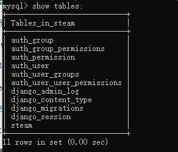
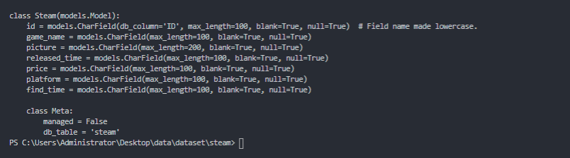

---

### 遗留问题

1. url页面实时性更新，测试发现if语句判断（价格和标签）会有在某些时候无法判断或（list(out of range)）的情况
2. 定时查询的功能还未得到实质性测试证明有效
3. 反爬虫机制只实现了模拟浏览器
4. 时间原因未完成将数据库中的内容展示在网页并提供按名称搜索的功能，后续会补足完善
---

### 附加内容

1. 搭建了服务器试图把项目部署到自己的网站上但是域名备案期还没过，如果之后有机会的话可以提交呀  
服务器配置为：阿里云ECS，Ubuntu18.04,Xshell6,Xftp6,python3.6.9,mysql5.7，进行了wsgi和nginx，django等环境的搭建  
网址：www.moumouismywife.com.cm  
(打不开的，还在备案QAQ)
